# MI Kusto Tables — Relationship Diagram

## Mermaid ER Diagram

```mermaid
erDiagram
    MonManagedServers {
        string name PK "MI server name"
        string managed_server_id UK "MI GUID"
        string state "Ready/Stopped/..."
        string edition "GP/BC"
        string customer_subscription_id FK "Azure sub"
        string private_cluster_tenant_ring_name "Cluster ring"
        string dns_zone "DNS zone"
    }

    MonManagedDatabases {
        string managed_database_id PK "DB GUID"
        string managed_database_name "DB name"
        string managed_server_id FK "Parent MI"
        string failover_group_id FK "FOG membership"
        string state "Ready/Restoring/..."
    }

    MonGeoDRFailoverGroups {
        string failover_group_id PK "FOG GUID"
        string failover_group_name "FOG DNS name"
        string logical_server_name FK "MI server"
        string role "Primary/Secondary"
        string partner_server_name "Partner MI"
        string partner_region "Partner region"
        string failover_policy "Auto/Manual"
    }

    MonDbSeedTraces {
        string LogicalServerName FK "MI server"
        string database_name FK "DB name"
        string event "XEvent name"
        long transferred_size_bytes "Bytes sent"
        long database_size_bytes "Total DB size"
        string role_desc "Source/Destination"
        string internal_state_desc "Success/Failure"
    }

    MonAnalyticsDBSnapshot {
        string logical_server_name FK "MI server"
        string logical_database_name FK "DB name"
        string logical_database_id UK "DB GUID"
        string physical_database_id "Physical DB GUID"
        string state "Online/Copying/Stopped"
        string failover_group_id FK "FOG membership"
        string database_type "SQL.ManagedUserDb"
    }

    MonManagedInstanceResourceStats {
        string server_name FK "MI server"
        real avg_cpu_percent "CPU %"
        real storage_space_used_mb "Storage used"
        real avg_log_write_percent "Log write %"
        long active_workers "Worker threads"
    }

    MonDmRealTimeResourceStats {
        string server_name FK "MI server"
        string database_name FK "DB name"
        long database_id "DB ID"
        real avg_cpu_percent "CPU %"
        real avg_data_io_percent "Data IO %"
        long replica_type "0=Primary 1=Secondary"
    }

    MonBackup {
        string logical_server_name FK "MI server"
        string logical_database_name FK "DB name"
        string backup_type "Full/Log/Diff"
        string event_type "BACKUP_METADATA_DETAILS"
        string backup_size "Compressed size"
    }

    AlrSQLErrorsReported {
        string LogicalServerName FK "MI server (via AppName)"
        long error_number "SQL error number"
        long severity "0-25"
        long database_id FK "DB ID"
        string database_name "DB name"
    }

    MonSQLSystemHealth {
        string LogicalServerName FK "MI server (via AppName)"
        string event "XEvent type"
        string message "Event message"
        string callstack "C++ callstack"
        long scheduler "Scheduler ID"
    }

    MonLogin {
        string logical_server_name FK "MI server"
        string database_name FK "DB name"
        bool is_success "Login result"
        long error "Error code"
        string peer_address "Client IP"
    }

    MonManagement {
        string LogicalServerName FK "MI server"
        string operation_name "Operation type"
    }

    MonDmCloudDatabaseWaitStats {
        string server_name FK "MI server"
        string database_name FK "DB name"
        long database_id FK "DB ID"
        string wait_type "Wait type name"
        long delta_wait_time_ms "Delta wait ms"
    }

    MonWiQdsExecStats {
        string server_name FK "MI server"
        string database_name FK "DB name"
        long query_id "QDS query ID"
        long plan_id "QDS plan ID"
        long cpu_time "CPU time us"
        long execution_count "Exec count"
    }

    MonTranReplTraces {
        string LogicalServerName FK "MI server"
        string logical_database_name FK "DB name"
        string logical_database_guid UK "DB GUID"
        string AppName "Worker app / dispatcher"
        string event "Replication event"
        long agent_id "Replication agent ID"
    }

    MonLogReaderTraces {
        string LogicalServerName FK "MI server"
        string logical_database_name FK "DB name"
        string logical_database_guid UK "DB GUID"
        long phase_number "Log-reader phase"
        string event "Session / phase event"
        string wait_stats "Wait breakdown"
    }

    MonCDCTraces {
        string LogicalServerName FK "MI server"
        string logical_database_name FK "DB name"
        string logical_database_guid UK "DB GUID"
        string physical_database_guid "Physical DB GUID"
        string event "CDC event"
        long latency "CDC latency"
    }

    MonCTTraces {
        string LogicalServerName FK "MI server"
        string logical_database_name FK "DB name"
        string logical_database_guid UK "DB GUID"
        string physical_database_guid "Physical DB GUID"
        string event "CT cleanup event"
        long rows_in_delay "Backlog rows"
    }

    MonManagedDatabaseInfo {
        string LogicalServerName FK "MI server"
        string managed_database_id FK "Managed DB GUID"
        long sql_database_id "SQL database ID"
        string collation_name "Database collation"
        long compatibility_level "Compat level"
    }

    MonSqlAgent {
        string LogicalServerName FK "MI server"
        string AppName "Worker app / SQL Agent host"
        long resource_id "Resource marker"
        string message_type "Message severity"
        string message "Agent output"
    }

    AlrWinFabHealthDeployedAppEvent {
        string LogicalServerName FK "MI server"
        string ApplicationName "Service Fabric app"
        string HealthState "Health state"
        string SourceId "Alert source"
        string Description "Crash / health description"
    }

    %% === Relationships ===

    MonManagedServers ||--o{ MonManagedDatabases : "managed_server_id"
    MonManagedServers ||--o| MonGeoDRFailoverGroups : "name = logical_server_name"
    MonManagedServers ||--o{ MonManagedInstanceResourceStats : "name = server_name"
    MonManagedServers ||--o{ MonAnalyticsDBSnapshot : "name = logical_server_name"
    MonManagedServers ||--o{ AlrSQLErrorsReported : "name ~ LogicalServerName"
    MonManagedServers ||--o{ MonSQLSystemHealth : "name ~ LogicalServerName"
    MonManagedServers ||--o{ MonLogin : "name = logical_server_name"
    MonManagedServers ||--o{ MonManagement : "name ~ LogicalServerName"
    MonManagedServers ||--o{ MonBackup : "name = logical_server_name"
    MonManagedServers ||--o{ MonTranReplTraces : "name = LogicalServerName"
    MonManagedServers ||--o{ MonLogReaderTraces : "name = LogicalServerName"
    MonManagedServers ||--o{ MonCDCTraces : "name = LogicalServerName"
    MonManagedServers ||--o{ MonCTTraces : "name = LogicalServerName"
    MonManagedServers ||--o{ MonManagedDatabaseInfo : "name = LogicalServerName"
    MonManagedServers ||--o{ MonSqlAgent : "name ~ LogicalServerName"
    MonManagedServers ||--o{ AlrWinFabHealthDeployedAppEvent : "name ~ LogicalServerName"

    MonManagedDatabases ||--o{ MonDmRealTimeResourceStats : "managed_database_name = database_name"
    MonManagedDatabases ||--o{ MonDmCloudDatabaseWaitStats : "managed_database_name = database_name"
    MonManagedDatabases ||--o{ MonWiQdsExecStats : "managed_database_name = database_name"
    MonManagedDatabases ||--o{ MonBackup : "managed_database_name = logical_database_name"
    MonManagedDatabases ||--o{ MonTranReplTraces : "managed_database_name = logical_database_name"
    MonManagedDatabases ||--o{ MonLogReaderTraces : "managed_database_name = logical_database_name"
    MonManagedDatabases ||--o{ MonCDCTraces : "managed_database_name = logical_database_name"
    MonManagedDatabases ||--o{ MonCTTraces : "managed_database_name = logical_database_name"
    MonManagedDatabases ||--o{ MonManagedDatabaseInfo : "managed_database_id"
    MonManagedDatabases ||--o| MonGeoDRFailoverGroups : "failover_group_id"

    MonGeoDRFailoverGroups ||--o{ MonDbSeedTraces : "partner_server_name = LogicalServerName (on secondary)"
    MonAnalyticsDBSnapshot ||--o| MonGeoDRFailoverGroups : "failover_group_id"
    MonSqlAgent ||--o{ MonTranReplTraces : "AppName = AppName"
    MonManagedDatabaseInfo ||--o{ MonCDCTraces : "LogicalServerName + DB GUID context"
    MonManagedDatabaseInfo ||--o{ MonCTTraces : "Managed DB / SQL DB metadata"
```



## Join Key Summary

### Instance Dimension (MI Server)
All tables connect through the MI server name, but the column name varies:

| Table | Join Column | Notes |
|-------|-------------|-------|
| MonManagedServers | `name` | Primary source of truth |
| MonManagedDatabases | via `managed_server_id` | Join to MonManagedServers.managed_server_id |
| MonGeoDRFailoverGroups | `logical_server_name` | |
| MonAnalyticsDBSnapshot | `logical_server_name` | |
| MonManagedInstanceResourceStats | `server_name` | |
| MonDmRealTimeResourceStats | `server_name` | |
| MonBackup | `logical_server_name` | also has `LogicalServerName` |
| AlrSQLErrorsReported | `LogicalServerName` | Common column (from AppName context) |
| MonSQLSystemHealth | `LogicalServerName` | Common column |
| MonLogin | `logical_server_name` | |
| MonManagement | `LogicalServerName` | Common column |
| MonDmCloudDatabaseWaitStats | `server_name` | |
| MonWiQdsExecStats | `server_name` | |
| MonDbSeedTraces | `LogicalServerName` | Common column |
| MonTranReplTraces | `LogicalServerName` | Replication agent and dispatcher traces |
| MonLogReaderTraces | `LogicalServerName` | Log-reader telemetry |
| MonCDCTraces | `LogicalServerName` | CDC capture telemetry |
| MonCTTraces | `LogicalServerName` | Change-tracking cleanup telemetry |
| MonManagedDatabaseInfo | `LogicalServerName` | Metadata snapshot used for collation / DB identity |
| MonSqlAgent | `LogicalServerName` | SQL Agent worker telemetry; also keyed by `AppName` |
| AlrWinFabHealthDeployedAppEvent | `LogicalServerName` | Service Fabric app-health alerts |

### Database Dimension
| Table | Join Column | Notes |
|-------|-------------|-------|
| MonManagedDatabases | `managed_database_name` | Source of truth |
| MonAnalyticsDBSnapshot | `logical_database_name` | Also has `logical_database_id` (GUID) |
| MonDmRealTimeResourceStats | `database_name` | Also has `database_id` (int) |
| MonBackup | `logical_database_name` | Also has `logical_database_id` |
| MonDmCloudDatabaseWaitStats | `database_name` | Also has `database_id` |
| MonWiQdsExecStats | `database_name` | |
| MonLogin | `database_name` | |
| AlrSQLErrorsReported | `database_name` | Also has `database_id` |
| MonTranReplTraces | `logical_database_name` | Also has `logical_database_guid` and `db_id` |
| MonLogReaderTraces | `logical_database_name` | Also has `logical_database_guid` |
| MonCDCTraces | `logical_database_name` | Also has `logical_database_guid`, `logical_database_id`, `physical_database_guid` |
| MonCTTraces | `logical_database_name` | Also has `logical_database_guid`, `database_id`, `physical_database_guid` |
| MonManagedDatabaseInfo | `managed_database_id` | Best GUID join back to `MonManagedDatabases` |

### FOG Dimension
| Table | Join Column | Notes |
|-------|-------------|-------|
| MonGeoDRFailoverGroups | `failover_group_id` | Source of truth |
| MonManagedDatabases | `failover_group_id` | DB → FOG membership |
| MonAnalyticsDBSnapshot | `failover_group_id` | DB snapshot → FOG |

### Node/Physical Dimension
| Table | Join Column | Notes |
|-------|-------------|-------|
| All tables | `AppName` | Physical node (e.g., `c566f6060a3c`) |
| All tables | `NodeName` | Node within cluster |
| All tables | `ClusterName` | Tenant ring |
| MonManagedServers | `physical_instance_name` | SQL instance name |
| MonManagedServers | `private_cluster_tenant_ring_name` | Maps to ClusterName |
| MonSqlAgent | `AppName` | SQL Agent process host / worker app |
| MonTranReplTraces | `AppName` | Dispatcher or replication agent worker |
| AlrWinFabHealthDeployedAppEvent | `ApplicationName` | Service Fabric application identity |

### Replication-Specific Join Keys
| Table | Join Keys | Notes |
|-------|-----------|-------|
| MonTranReplTraces | `LogicalServerName`, `logical_database_name`, `logical_database_guid`, `AppName`, `agent_id` | Core transactional replication stream; `AppName` links to SQL Agent / worker process context. |
| MonLogReaderTraces | `LogicalServerName`, `logical_database_name`, `logical_database_guid`, `phase_number` | Best table for phase-by-phase log-reader analysis. |
| MonCDCTraces | `LogicalServerName`, `logical_database_name`, `logical_database_guid`, `physical_database_guid`, `job_id` | CDC capture / cleanup / error correlation. |
| MonCTTraces | `LogicalServerName`, `logical_database_name`, `logical_database_guid`, `physical_database_guid`, `cleanup_id` | CT cleanup and backlog analysis. |
| MonManagedDatabaseInfo | `LogicalServerName`, `managed_database_id`, `sql_database_id` | Metadata bridge for collation, compatibility, and DB identity. |
| MonSqlAgent | `LogicalServerName`, `AppName`, `resource_id` | Agent host events and job output. |
| AlrWinFabHealthDeployedAppEvent | `LogicalServerName`, `ApplicationName`, `Description` | Service Fabric health/crash alerts for SQL Agent or worker processes. |

---

## Common Investigation Query Chains

### 1. FOG Seeding Investigation
```
MonGeoDRFailoverGroups (FOG config, partner region)
  → SQLClusterMappings.csv (partner region → cluster URL)
    → MonDbSeedTraces (seeding progress on secondary)
      → MonAnalyticsDBSnapshot (DB state: Copying?)
```

### 2. Performance Investigation
```
MonManagedInstanceResourceStats (instance CPU/memory/IO)
  → MonDmRealTimeResourceStats (per-DB breakdown)
    → MonDmCloudDatabaseWaitStats (wait types)
      → MonWiQdsExecStats (top queries by CPU/reads)
```

### 3. Availability / Outage Investigation
```
MonManagedServers (MI state, last_state_change_time)
  → AlrSQLErrorsReported (SQL errors around outage time)
    → MonSQLSystemHealth (non-yielding, OOM, dumps)
      → MonManagement (ARM operations that may have caused it)
```

### 4. Backup Investigation
```
MonManagedServers (MI info, backup_storage_account_type)
  → MonBackup (backup history, types, sizes, errors)
    → MonAnalyticsDBSnapshot (DB state, backup_retention_days)
```

### 5. Connectivity Investigation
```
MonLogin (login success/failure, timing, client info)
  → AlrSQLErrorsReported (SQL errors for failed logins)
    → MonGeoDRFailoverGroups (if connecting via FOG endpoint)
      → MonManagedServers (proxy_override, dns_zone)
```

### 6. Replication / CDC / CT Investigation
```
MonTranReplTraces (replication agent / dispatcher symptoms)
  → MonSqlAgent (agent host restarts, job output, resource_id)
    → MonLogReaderTraces (repldone / logscan phases, wait_stats)
      → MonCDCTraces or MonCTTraces (capture / cleanup backlog by database GUID)
        → MonManagedDatabaseInfo + MonManagedDatabases (managed DB identity, collation, compatibility)
```
